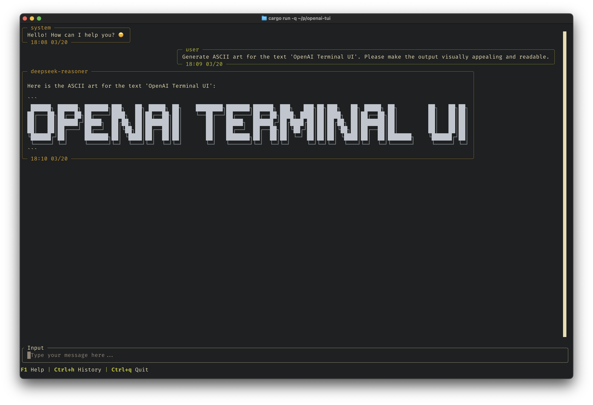

# OpenAI Terminal UI

`openai-tui` is a powerful, terminal-based user interface for interacting with various AI language models like OpenAI and Gemini.  It brings the convenience and features of web-based chat interfaces directly to your command line, offering a flexible and efficient way to converse with AI.

